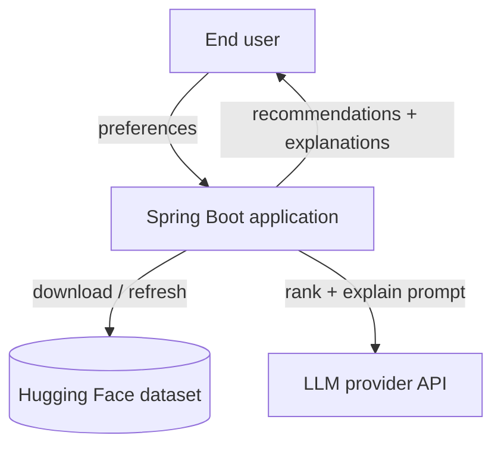
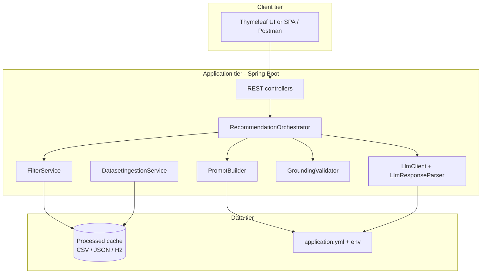
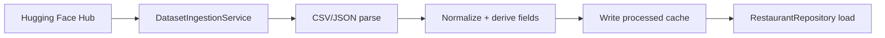
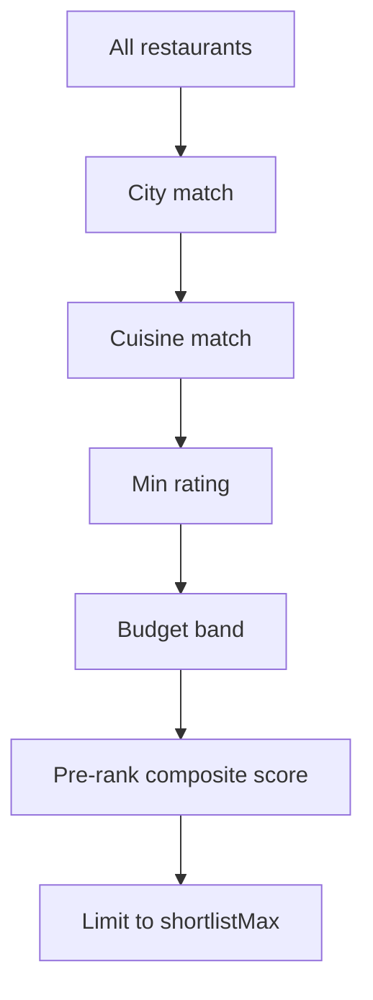
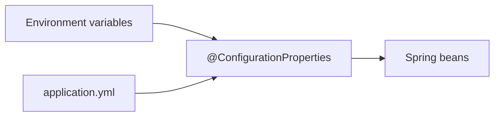
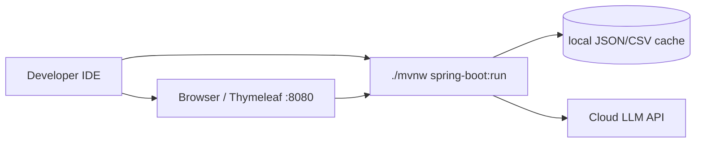
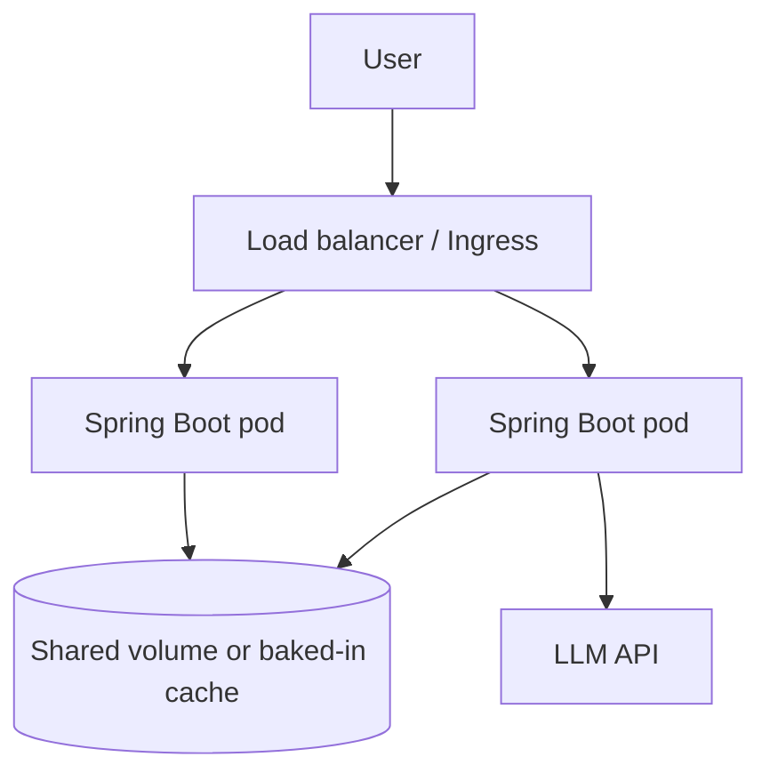
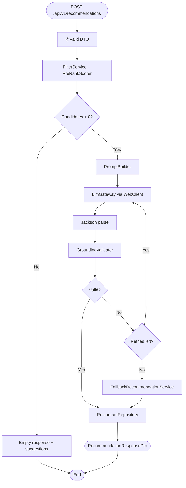

# System Architecture: AI-Powered Restaurant Recommendation System

This document describes the detailed technical architecture for the ZOMATO project, derived from [problemStatement.md](./problemStatement.md). It defines components, data flows, interfaces, and implementation guidance for a **hybrid retrieval + generation** recommender grounded in the Hugging Face Zomato dataset.

**Tech stack:** Java 21, Spring Boot 3.x, Maven, REST API, in-memory (or H2) restaurant store, WebClient for LLM calls.

---

## 1. Architecture overview

### 1.1 Design principles

| Principle | Implication |
|-----------|-------------|
| **Grounded recommendations** | The LLM may only rank and explain restaurants present in the filtered candidate set; outputs are validated against candidate IDs/names. |
| **Separation of retrieval and reasoning** | Deterministic filters shrink ~51k rows to a bounded shortlist; the LLM handles ranking, trade-offs, and natural-language explanations. |
| **Configurable boundaries** | Model provider, top-N, shortlist size, budget bands, and prompt templates are driven by configuration—not hard-coded. |
| **Fail gracefully** | Empty filter results, LLM timeouts, and malformed JSON trigger user-actionable fallbacks (relax filters, retry, rule-based ranking). |
| **Local-first data** | Processed dataset is cached on disk after first ingestion to avoid repeated Hugging Face downloads. |
| **Layered Spring design** | Controllers stay thin; business logic in services; domain models free of framework dependencies where practical. |

### 1.2 Tech stack

| Layer | Technology | Rationale |
|-------|------------|-----------|
| Language | **Java 21 (LTS)** | Modern language features, long-term support, strong typing |
| Framework | **Spring Boot 3.3+** | REST APIs, DI, config, testing, production readiness |
| Build | **Maven** | Standard Spring Boot tooling (`spring-boot-starter-parent`) |
| REST | **Spring Web** (`spring-boot-starter-web`) | Controllers, Jackson JSON, validation |
| Validation | **Jakarta Bean Validation** | Request DTO constraints (`@NotBlank`, `@Min`, etc.) |
| HTTP client (LLM) | **Spring WebFlux WebClient** | Non-blocking calls, timeouts, retries |
| Resilience | **Spring Retry** (optional) | LLM retry with backoff |
| Configuration | **`@ConfigurationProperties`** + `application.yml` | Typed, testable settings |
| Observability | **Spring Boot Actuator** | `/actuator/health`, metrics hooks |
| Data at runtime | **In-memory repository** (MVP) | ~52k rows fit comfortably in heap |
| Data at rest | **CSV or JSON** cache file | Portable; no DB required for MVP |
| Optional persistence | **Spring Data JPA + H2** | SQL-style filters if in-memory streams become limiting |
| CSV / ingest | **OpenCSV** or **Apache Commons CSV** + Jackson | Parse Hugging Face export or hub download |
| Prompt templates | **Classpath text** + simple placeholder replace, or **Mustache4j** | Versioned under `src/main/resources/prompts/` |
| LLM JSON parsing | **Jackson** (`ObjectMapper`) | Map provider response to `RecommendationResponse` |
| API docs | **springdoc-openapi** (optional) | Swagger UI for `/api/v1` |
| UI (optional) | **Thymeleaf** (server-rendered) or **React SPA** | Thymeleaf for quick MVP; React for richer UX |
| Testing | **JUnit 5**, **Mockito**, **MockMvc**, **WireMock** | Unit, slice, and API tests |
| Container | **Docker** + **JRE 21** image | Multi-stage build with pre-ingested data |

### 1.3 High-level system context (C4 — Context)



**Actors**

- **End user** — Submits location, budget, cuisine, minimum rating, and optional free-text preferences; receives top-N recommendations.
- **Hugging Face** — Source of truth for restaurant records (~51.7k rows).
- **LLM provider** — External API (Groq) for ranking and explanation generation.

### 1.4 Container diagram (C4 — Containers)



---

## 2. Logical architecture (layers)

```mermaid
flowchart TB
  subgraph presentation [Presentation layer]
    P1["@RestController endpoints"]
    P2[Request/response DTOs + @Valid]
    P3[@ControllerAdvice exception handling]
  end

  subgraph application [Application layer - @Service]
    A1[RecommendationOrchestrator]
    A2[DatasetIngestionService]
    A3[MetadataService]
  end

  subgraph domain [Domain layer]
    D1[UserPreferences]
    D2[Restaurant]
    D3[RecommendationResult]
    D4[BudgetBand + FilterCriteria]
  end

  subgraph infrastructure [Infrastructure layer]
    I1[HuggingFaceDatasetClient]
    I2[RestaurantRepository]
    I3[FilterEngine]
    I4[LlmGateway + adapters]
    I5[PromptTemplateLoader]
    I6[GroundingValidator]
  end

  P1 --> P2 --> A1
  P3 --> P1
  A1 --> D1 & D2 & D3
  A1 --> I2 & I3 & I4 & I5 & I6
  A2 --> I1 --> I2
```

### 2.1 Layer responsibilities

**Presentation** (`com.zomato.recommendation.api`) — REST controllers, DTOs, validation, HTTP status mapping. Delegates to application services only.

**Application** (`com.zomato.recommendation.service`) — Orchestrates use cases: recommend, ingest, list metadata. Transaction boundaries if JPA is used.

**Domain** (`com.zomato.recommendation.domain`) — Records/classes and pure logic: enums (`BudgetBand`), value objects, filter scoring. No Spring annotations required.

**Infrastructure** (`com.zomato.recommendation.infrastructure`) — Repository implementations, WebClient LLM adapters, CSV/JSON I/O, prompt loading.

### 2.2 Spring Boot module layout (single deployable JAR)

One Maven module for MVP (`zomato-recommendation`). Split into `zomato-api` + `zomato-core` later only if the codebase grows.

---

## 3. Core components

### 3.1 Dataset ingestion & preprocessing

**Purpose:** Download (once), clean, normalize, and persist restaurant records for fast filtering.



**Processing steps**

1. **Download** — `HuggingFaceDatasetClient` fetches dataset files via Hugging Face Hub HTTP API (or reads a manual CSV export placed in `data/raw/`).
2. **Column mapping** — Map raw headers to canonical fields; document discovered mapping in `data/schema.json` after first successful ingest.
3. **Normalization**
   - Trim strings; normalize city casing (`Locale.ROOT`).
   - Split comma-separated cuisines into `List<String>`.
   - Parse `rating` and `costForTwo` as `BigDecimal` / `Integer`; skip invalid rows with logged counts.
4. **Derived fields**
   - `restaurantId` — UUID or stable hash of name + city.
   - `budgetBand` — `LOW` | `MEDIUM` | `HIGH` from cost percentiles.
5. **Persist** — `data/processed/restaurants.json` (Jackson) or `restaurants.csv` (+ `metadata.json`: row count, ingest time, band thresholds).

**Trigger**

- **Admin endpoint:** `POST /api/v1/admin/ingest` (dev profile or API-key protected).
- **CLI:** `java -jar app.jar --ingest` using `ApplicationRunner` when a command-line flag is set.
- **Startup:** Optional `DataLoader` `@PostConstruct` if cache file is missing (dev only).

### 3.2 Restaurant repository

**Purpose:** Abstract read access to processed data.

| Operation | Java signature (conceptual) |
|-----------|----------------------------|
| Find by id | `Optional<Restaurant> findById(String id)` |
| Filter | `List<Restaurant> findByCriteria(FilterCriteria criteria)` |
| List cities | `List<String> findDistinctCities()` |
| List cuisines | `List<String> findDistinctCuisines(Optional<String> city)` |
| Stats | `CityStats stats(String city)` — counts, percentiles for bands |

**MVP implementation:** `InMemoryRestaurantRepository` — loads all rows into `List<Restaurant>` at startup; filters via Java streams.

**Optional upgrade:** `JpaRestaurantRepository` + H2 file DB for SQL predicates and indexes on `city`, `rating`.

### 3.3 Filter / retrieval engine

**Purpose:** Deterministically reduce the corpus to a **shortlist** (default 15–30 rows) before the LLM call.

**Implementation:** `FilterService` / `FilterEngine` (plain Java or `@Service`).



| Filter | Rule |
|--------|------|
| Location | Case-insensitive equality/contains on `city` |
| Cuisine | Match on any cuisine token (case-insensitive) |
| Min rating | `rating >= minRating` |
| Budget | `budgetBand == user.budget` |

**Pre-ranking** — `PreRankScorer` computes weighted score; `Comparator` + `stream().limit(shortlistMax)`.

**Empty result** — Return `FilterResult.empty()` with `List<String> suggestions`; orchestrator does **not** call LLM.

### 3.4 Prompt builder

**Purpose:** Assemble a structured, token-bounded prompt from user preferences and the shortlist.

**Implementation:** `PromptBuilder` loads `classpath:prompts/recommend-v1.txt`, substitutes placeholders (`{{preferences}}`, `{{candidatesJson}}`, `{{topN}}`).

**Prompt structure** — Same semantic contract as before (system rules, preferences, capped JSON candidates, JSON output schema).

**Token control** — Serialize only id, name, cuisines, rating, cost, location via Jackson; enforce `shortlistMax` in `FilterService` before build.

### 3.5 LLM gateway

**Purpose:** Provider-agnostic client with timeouts, retries, and structured output.

```sequenceDiagram
  participant O as RecommendationOrchestrator
  participant G as LlmGateway
  participant W as WebClient
  participant P as Provider API

  O->>G: complete(LlmRequest)
  G->>W: POST chat/completions
  W->>P: HTTP
  P-->>W: JSON body
  W-->>G: raw content
  G-->>O: RecommendationResponse
```

**Interface**

```java
public interface LlmGateway {
    RecommendationResponse complete(LlmRequest request);
}
```

**Implementations**

- `GroqLlmGateway` - Groq chat API integration.
- `AnthropicLlmGateway` — Optional second adapter.
- Selected via `@ConditionalOnProperty(name = "app.llm.provider")` or explicit `@Primary` bean.

**WebClient configuration** — `ConnectionProvider`, `responseTimeout`, `Retry.backoff` for 429/503.

| Property (`application.yml`) | Default | Notes |
|------------------------------|---------|-------|
| `app.llm.provider` | `groq` | Bean selection |
| `app.llm.model` | `llama3-8b-8192` | Dev cost control |
| `app.llm.timeout` | `30s` | `Duration` |
| `app.llm.max-retries` | `2` | Spring Retry |
| `app.llm.temperature` | `0.2` | Consistent ranking |

Secrets: `GROQ_API_KEY` bound to `app.llm.api-key` via environment variable.

### 3.6 Grounding validator

**Purpose:** Ensure LLM output only references restaurants from the shortlist.

**Implementation:** `GroundingValidator` — `Set<String>` of allowed ids from shortlist; validate Jackson-deserialized `LlmRecommendationDto` list.

**On failure**

1. Retry once with corrective system message.
2. **Fallback:** `FallbackRecommendationService` returns top-N from pre-rank order with template explanations; set `meta.degraded = true`.

### 3.7 Recommendation orchestrator

**Purpose:** Single entry point for the recommend use case.

```sequenceDiagram
  participant C as RecommendationController
  participant O as RecommendationOrchestrator
  participant F as FilterService
  participant PB as PromptBuilder
  participant L as LlmGateway
  participant V as GroundingValidator
  participant R as RestaurantRepository

  C->>O: UserPreferences
  O->>F: filter(preferences)
  alt no candidates
    F-->>O: empty
    O-->>C: 200 + suggestions
  else has candidates
    F-->>O: shortlist
    O->>PB: build(shortlist, preferences)
    O->>L: complete(request)
    L-->>O: llmResponse
    O->>V: validate(llmResponse, shortlist)
    O->>R: enrich(ids)
    O-->>C: RecommendationResponseDto
  end
```

**Bean:** `@Service class RecommendationOrchestrator` — constructor-injected dependencies.

---

## 4. Data architecture

### 4.1 Canonical restaurant model

```java
public record Restaurant(
    String restaurantId,
    String name,
    String city,
    String location,
    List<String> cuisines,
    BigDecimal rating,
    Integer costForTwo,
    BudgetBand budgetBand,
    Integer votes
) {}
```

| Field | Java type | Description |
|-------|-----------|-------------|
| `restaurantId` | `String` | Stable id for grounding |
| `name` | `String` | Restaurant name |
| `city` | `String` | Location filter |
| `location` | `String` | Display address/area |
| `cuisines` | `List<String>` | Cuisine labels |
| `rating` | `BigDecimal` | e.g. 0–5 |
| `costForTwo` | `Integer` | Approximate cost |
| `budgetBand` | `BudgetBand` enum | `LOW`, `MEDIUM`, `HIGH` |
| `votes` | `Integer` | Optional popularity |

### 4.2 Budget band calibration

Computed at ingest by `BudgetBandCalculator` using cost percentiles (global or per-city); thresholds stored in `metadata.json`.

### 4.3 Configuration model



**Example `application.yml`**

```yaml
spring:
  application:
    name: zomato-recommendation

app:
  data:
    cache-path: data/processed/restaurants.json
    dataset-id: ManikaSaini/zomato-restaurant-recommendation

  recommendation:
    top-n: 5
    shortlist-max: 20
    pre-rank:
      rating-weight: 0.5
      cost-weight: 0.3
      cuisine-weight: 0.2

  llm:
    provider: groq
    base-url: https://api.groq.com/openai/v1
    model: llama3-8b-8192
    api-key: ${GROQ_API_KEY}
    temperature: 0.2
    timeout: 30s
    max-retries: 2
```

**Properties class**

```java
@ConfigurationProperties(prefix = "app")
@Validated
public record AppProperties(
    DataProperties data,
    RecommendationProperties recommendation,
    LlmProperties llm
) {}
```

Enable with `@EnableConfigurationProperties(AppProperties.class)`.

---

## 5. API design

### 5.1 REST endpoints (Spring MVC)

| Method | Path | Controller | Description |
|--------|------|------------|-------------|
| `GET` | `/actuator/health` | Actuator | Liveness/readiness |
| `POST` | `/api/v1/recommendations` | `RecommendationController` | Main flow |
| `GET` | `/api/v1/metadata/cities` | `MetadataController` | City dropdown |
| `GET` | `/api/v1/metadata/cuisines` | `MetadataController` | `?city=Delhi` optional |
| `POST` | `/api/v1/admin/ingest` | `AdminController` | Trigger ingest (`@Profile("dev")` or secured) |

### 5.2 Request / response DTOs

**Request** — `RecommendationRequestDto` with Bean Validation:

```java
public record RecommendationRequestDto(
    @NotBlank String location,
    @NotNull BudgetBand budget,
    @NotBlank String cuisine,
    @DecimalMin("0.0") @DecimalMax("5.0") BigDecimal minRating,
    String additionalPreferences,
    @Min(1) @Max(10) Integer topN
) {}
```

**Response** — `RecommendationResponseDto` (records + Jackson serialization). JSON shape unchanged from prior design:

```json
{
  "recommendations": [
    {
      "restaurantId": "abc123",
      "name": "Example Bistro",
      "cuisines": ["Italian", "Continental"],
      "rating": 4.5,
      "costForTwo": 1200,
      "explanation": "Matches your Italian preference and medium budget..."
    }
  ],
  "summary": "These picks balance high ratings with your date-night request.",
  "meta": {
    "candidatesConsidered": 18,
    "degraded": false
  }
}
```

### 5.3 Error model

**Implementation:** `@RestControllerAdvice` maps exceptions to `ErrorResponse` JSON.

| HTTP | Code | Exception / case |
|------|------|------------------|
| 400 | `VALIDATION_ERROR` | Illegal argument, bad enum |
| 400 | — | `MethodArgumentNotValidException` (Bean Validation) |
| 503 | `LLM_UNAVAILABLE` | `LlmException` after retries |
| 500 | `INTERNAL_ERROR` | Unhandled; include `traceId` from MDC |

Use **`ProblemDetail`** (RFC 7807) optionally via `ResponseEntityExceptionHandler` for consistent error bodies.

---

## 6. Deployment architecture

### 6.1 Development



### 6.2 Production (optional)



**Dockerfile (multi-stage)**

1. **Build stage:** `maven:3.9-eclipse-temurin-21` — `mvn -DskipTests package`; optional ingest step downloads data.
2. **Run stage:** `eclipse-temurin:21-jre` — copy JAR + `data/processed/`; `ENTRYPOINT java -jar app.jar`.
3. Inject `GROQ_API_KEY` at runtime via orchestrator secrets.

---

## 7. Cross-cutting concerns

### 7.1 Observability

| Concern | Spring approach |
|---------|-----------------|
| Logging | SLF4J + Logback; MDC `traceId`; log filter count, LLM latency |
| Health | Actuator `/actuator/health`; custom indicator `RestaurantDataHealthIndicator` |
| Metrics | Micrometer: `recommendation.latency`, `llm.errors`, `filter.empty` |
| Tracing | Micrometer Tracing + OpenTelemetry (optional) |

### 7.2 Security

- API keys only in environment / K8s secrets; never in `application.yml` committed to Git.
- Spring Security (optional MVP): permit `/api/v1/recommendations` + metadata; secure `/admin/**`.
- Rate limiting via Bucket4j or API gateway in production.

### 7.3 Performance

| Stage | Target (MVP) |
|-------|----------------|
| Filter + pre-rank | < 150 ms (in-memory streams, 52k rows) |
| LLM call | 2–8 s |
| Total P95 | < 15 s |

**Mitigations:** Load restaurant list once at startup (`@EventListener(ApplicationReadyEvent)`); use WebClient reactive stack; `@Cacheable` on metadata endpoints.

### 7.4 Testing strategy

| Level | Tools | Focus |
|-------|-------|-------|
| Unit | JUnit 5, Mockito | `FilterEngine`, `PreRankScorer`, `GroundingValidator`, `BudgetBandCalculator` |
| Slice | `@WebMvcTest` | Controllers, validation, error mapping |
| Integration | `@SpringBootTest` + test `application.yml` | Orchestrator with mocked `LlmGateway` |
| Contract | WireMock | Stub Groq HTTP responses |
| E2E | MockMvc `POST /api/v1/recommendations` | Full pipeline with fixture data |

Fixture: `src/test/resources/fixtures/restaurants-small.json` (~100 rows), no 574 MB download in CI.

---

## 8. Proposed repository structure

```
ZOMATO/
├── pom.xml
├── src/
│   ├── main/
│   │   ├── java/com/zomato/recommendation/
│   │   │   ├── ZomatoRecommendationApplication.java
│   │   │   ├── api/
│   │   │   │   ├── RecommendationController.java
│   │   │   │   ├── MetadataController.java
│   │   │   │   ├── AdminController.java
│   │   │   │   ├── dto/
│   │   │   │   └── GlobalExceptionHandler.java
│   │   │   ├── config/
│   │   │   │   ├── AppProperties.java
│   │   │   │   ├── WebClientConfig.java
│   │   │   │   └── LlmGatewayConfig.java
│   │   │   ├── domain/
│   │   │   │   ├── Restaurant.java
│   │   │   │   ├── UserPreferences.java
│   │   │   │   ├── BudgetBand.java
│   │   │   │   └── FilterCriteria.java
│   │   │   ├── service/
│   │   │   │   ├── RecommendationOrchestrator.java
│   │   │   │   ├── FilterService.java
│   │   │   │   ├── PreRankScorer.java
│   │   │   │   ├── PromptBuilder.java
│   │   │   │   ├── GroundingValidator.java
│   │   │   │   ├── FallbackRecommendationService.java
│   │   │   │   ├── DatasetIngestionService.java
│   │   │   │   └── MetadataService.java
│   │   │   └── infrastructure/
│   │   │       ├── repository/
│   │   │       │   ├── RestaurantRepository.java
│   │   │       │   └── InMemoryRestaurantRepository.java
│   │   │       ├── llm/
│   │   │       │   ├── LlmGateway.java
│   │   │       │   ├── GroqLlmGateway.java
│   │   │       │   └── LlmResponseParser.java
│   │   │       ├── dataset/
│   │   │       │   └── HuggingFaceDatasetClient.java
│   │   │       └── loader/
│   │   │           └── RestaurantDataLoader.java
│   │   └── resources/
│   │       ├── application.yml
│   │       ├── application-dev.yml
│   │       └── prompts/
│   │           └── recommend-v1.txt
│   └── test/
│       └── java/...                    # mirror package structure
├── data/
│   └── processed/                      # gitignored (fixtures in test/resources)
├── docs/
│   ├── problemStatement.md
│   └── architecture.md
├── Dockerfile
└── README.md
```

### 8.1 Key Maven dependencies

```xml
<dependencies>
  <dependency>
    <groupId>org.springframework.boot</groupId>
    <artifactId>spring-boot-starter-web</artifactId>
  </dependency>
  <dependency>
    <groupId>org.springframework.boot</groupId>
    <artifactId>spring-boot-starter-validation</artifactId>
  </dependency>
  <dependency>
    <groupId>org.springframework.boot</groupId>
    <artifactId>spring-boot-starter-webflux</artifactId> <!-- WebClient -->
  </dependency>
  <dependency>
    <groupId>org.springframework.boot</groupId>
    <artifactId>spring-boot-starter-actuator</artifactId>
  </dependency>
  <!-- optional: spring-boot-starter-data-jpa, h2 -->
  <!-- test: spring-boot-starter-test -->
</dependencies>
```

---

## 9. Recommendation pipeline (end-to-end)



---

## 10. Evolution path (out of scope now, architecturally ready)

| Feature | Architectural hook |
|---------|-------------------|
| Semantic search | Embedding client + vector store; merge ids before LLM |
| User accounts | Spring Security + JPA `UserProfile`; orchestrator input enrichment |
| Multi-city | Extend `UserPreferences` record |
| Local LLM (Ollama) | New `LlmGateway` bean, `app.llm.base-url` |
| Response caching | Spring Cache + Redis (`@Cacheable` on orchestrator) |
| Async API | `@Async` + job id polling, or Spring MVC deferred result |

---

## 11. Alignment with problem statement

| Problem statement requirement | Architecture element |
|------------------------------|----------------------|
| Real-world dataset | §3.1 `DatasetIngestionService`, §4.1 model |
| User preferences | §3.3 `FilterService`, §5.2 DTOs |
| LLM rank + explain | §3.4–3.5 `PromptBuilder`, `LlmGateway` |
| Grounded recommendations | §3.6 `GroundingValidator` |
| Clear output fields | §5.2 response DTO |
| Actionable failures | §3.3 empty handling, §5.3 `GlobalExceptionHandler` |
| Configurable secrets/models | §4.3 `@ConfigurationProperties` |
| Java + Spring Boot | §1.2 tech stack, §8 structure |

---

## 12. References

- [Problem statement](./problemStatement.md)
- [Spring Boot documentation](https://docs.spring.io/spring-boot/docs/current/reference/html/)
- [Dataset: ManikaSaini/zomato-restaurant-recommendation](https://huggingface.co/datasets/ManikaSaini/zomato-restaurant-recommendation)
