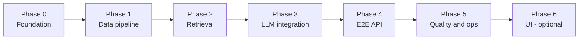

# Phase-Wise Implementation Plan

This plan breaks the ZOMATO project into sequential phases aligned with [problemStatement.md](./problemStatement.md) (goals and success criteria) and [architecture.md](./architecture.md) (components, stack, and structure). Each phase has **objectives**, **tasks**, **deliverables**, **acceptance criteria**, and **dependencies**.

**Stack:** Java 21, Spring Boot 3.x, Maven.

---

## Overview

| Phase | Name | Primary outcome | Maps to success criteria |
|-------|------|-----------------|--------------------------|
| 0 | Project foundation | Runnable Spring Boot app, config, repo layout | — (enabler) |
| 1 | Data pipeline | Ingested cache + in-memory repository | Dataset loads reliably |
| 2 | Retrieval layer | Filters, pre-rank, metadata APIs | Structured narrowing of ~51k rows |
| 3 | LLM integration | Prompt, WebClient gateway, JSON parsing | Personalized explanations |
| 4 | End-to-end recommendation | Orchestrator, grounding, fallback, main API | Top-N grounded recommendations |
| 5 | Quality & operations | Tests, errors, health, Docker, README | Actionable failures, operability |
| 6 | UI (optional) | Thymeleaf form + results page | Clear, scannable display |

**Estimated total (MVP, Phases 0–5):** ~3–4 weeks at moderate pace (one developer).

---

## Phase 0: Project foundation

**Goal:** Bootstrapped Spring Boot project with correct packages, configuration, and developer ergonomics.

**Architecture refs:** §1.2 tech stack, §8 repository structure, §4.3 configuration.

### Tasks

| # | Task | Output |
|---|------|--------|
| 0.1 | Generate Maven project (`spring-boot-starter-parent`, Java 21) | `pom.xml` |
| 0.2 | Add dependencies: web, validation, webflux, actuator, test | `pom.xml` |
| 0.3 | Create package structure under `com.zomato.recommendation` | `api`, `config`, `domain`, `service`, `infrastructure` |
| 0.4 | Add `ZomatoRecommendationApplication` + smoke test context load | Main class |
| 0.5 | Add `application.yml` + `application-dev.yml` with `app.*` placeholders | Config files |
| 0.6 | Implement `AppProperties` + `@EnableConfigurationProperties` | `config/AppProperties.java` |
| 0.7 | Add `.gitignore` (target/, `data/processed/`, `.env`) | Root |
| 0.8 | Add `.env.example` (`GROQ_API_KEY=`) | Root |
| 0.9 | Add minimal `README.md` (prerequisites, run, env vars) | Root |

### Deliverables

- `./mvnw spring-boot:run` starts on port 8080.
- Actuator health responds at `/actuator/health`.

### Acceptance criteria

- [ ] Project compiles with Java 21.
- [ ] `@SpringBootTest` context loads without errors.
- [ ] No secrets in committed files.

### Dependencies

- None.

---

## Phase 1: Data pipeline

**Goal:** Load the Hugging Face Zomato dataset, normalize it, persist a local cache, and expose restaurants via `RestaurantRepository`.

**Problem statement refs:** Data source, ingestion goals, workflow step 1.  
**Architecture refs:** §3.1 ingestion, §3.2 repository, §4.1 schema, §4.2 budget bands.

### Tasks

| # | Task | Output |
|---|------|--------|
| 1.1 | Define domain model: `Restaurant`, `BudgetBand` | `domain/` |
| 1.2 | Define `FilterCriteria` (placeholder fields for Phase 2) | `domain/FilterCriteria.java` |
| 1.3 | Create `RestaurantRepository` interface | `infrastructure/repository/` |
| 1.4 | Implement `BudgetBandCalculator` (percentiles → LOW/MEDIUM/HIGH) | `service/` or `domain/` |
| 1.5 | Implement `HuggingFaceDatasetClient` (download or read `data/raw/`) | `infrastructure/dataset/` |
| 1.6 | Implement CSV/JSON parsing + column mapping; log skipped rows | Ingestion parser |
| 1.7 | Implement `DatasetIngestionService` (normalize, derive `restaurantId`, bands, write cache) | `service/DatasetIngestionService.java` |
| 1.8 | Write `data/schema.json` after first successful mapping discovery | `data/schema.json` |
| 1.9 | Implement `InMemoryRestaurantRepository` + `RestaurantDataLoader` on `ApplicationReadyEvent` | Loader + repository |
| 1.10 | Add `AdminController` + `POST /api/v1/admin/ingest` (`@Profile("dev")`) | `api/AdminController.java` |
| 1.11 | Add test fixture `restaurants-small.json` (~100 rows) for CI | `src/test/resources/fixtures/` |
| 1.12 | Unit tests: `BudgetBandCalculator`, ingestion on fixture | `src/test/` |

### Deliverables

- Processed cache at `data/processed/restaurants.json` (+ `metadata.json`).
- All restaurants available in memory after startup.
- Dev ingest endpoint or CLI flag to refresh cache.

### Acceptance criteria

- [ ] Ingest produces valid `Restaurant` records with id, name, city, cuisines, rating, cost, budget band.
- [ ] Repository returns `findById` and full list count consistent with cache.
- [ ] Tests pass without downloading 574 MB in CI (fixture only).
- [ ] Invalid rows are skipped with logged summary counts.

### Dependencies

- Phase 0 complete.

### Notes

- For first local run, allow manual CSV export into `data/raw/` if Hub download is slow.
- Document column mapping in `data/schema.json` once known.

---

## Phase 2: Retrieval layer

**Goal:** Deterministic filtering and pre-ranking to produce a bounded shortlist; metadata endpoints for UI; empty-result suggestions.

**Problem statement refs:** User input table, integration layer (structured filters), workflow step 2–3 (partial).  
**Architecture refs:** §3.3 filter engine, §5.1 metadata endpoints.

### Tasks

| # | Task | Output |
|---|------|--------|
| 2.1 | Implement `UserPreferences` / map from request DTO | `domain/UserPreferences.java` |
| 2.2 | Implement `FilterService` (city, cuisine, min rating, budget band) | `service/FilterService.java` |
| 2.3 | Implement `PreRankScorer` + weighted composite score | `service/PreRankScorer.java` |
| 2.4 | Cap results to `app.recommendation.shortlist-max` | Inside `FilterService` |
| 2.5 | Implement `FilterResult` with shortlist + `suggestions` when empty | `domain/` |
| 2.6 | Implement `MetadataService` + distinct cities/cuisines | `service/MetadataService.java` |
| 2.7 | Add `MetadataController`: `GET /api/v1/metadata/cities`, `.../cuisines?city=` | `api/MetadataController.java` |
| 2.8 | Unit tests: each filter, pre-rank ordering, empty suggestions | `src/test/unit/` |
| 2.9 | Integration test: filter against fixture repository | `src/test/integration/` |

### Deliverables

- `FilterService.filter(UserPreferences)` returns ordered shortlist (≤ `shortlistMax`).
- Metadata APIs return real values from loaded data.

### Acceptance criteria

- [ ] Bangalore + Italian + medium + min 4.0 returns a non-empty shortlist on full data (manual check).
- [ ] Impossible filter combo returns empty list + ≥2 actionable suggestions.
- [ ] Pre-rank is deterministic for same input.
- [ ] Filter + pre-rank completes in &lt; 150 ms on full in-memory dataset (informal check).

### Dependencies

- Phase 1 complete (repository loaded).

---

## Phase 3: LLM integration

**Goal:** Provider-agnostic LLM client, prompt assembly, and structured JSON parsing—without full orchestration yet.

**Problem statement refs:** LLM rank + explain, technical considerations (grounding, token limits).  
**Architecture refs:** §3.4 prompt builder, §3.5 LLM gateway, §4.3 LLM config.

### Tasks

| # | Task | Output |
|---|------|--------|
| 3.1 | Add prompt template `resources/prompts/recommend-v1.txt` | Prompt file |
| 3.2 | Implement `PromptBuilder` (preferences + candidates JSON + topN) | `service/PromptBuilder.java` |
| 3.3 | Define `LlmRequest`, `LlmRecommendationDto`, `RecommendationResponse` domain/DTO types | `domain/` + `api/dto/` |
| 3.4 | Configure `WebClient` bean (timeout, base URL from `AppProperties`) | `config/WebClientConfig.java` |
| 3.5 | Implement `LlmGateway` interface + `GroqLlmGateway` | `infrastructure/llm/` |
| 3.6 | Implement `LlmResponseParser` (Jackson, handle markdown fences) | `infrastructure/llm/` |
| 3.7 | Wire `LlmGatewayConfig` (`@ConditionalOnProperty` for provider) | `config/LlmGatewayConfig.java` |
| 3.8 | Add Spring Retry on transient LLM failures (optional) | Config + gateway |
| 3.9 | WireMock test: stub chat completion → parsed response | `src/test/` |
| 3.10 | Manual integration test with real API key (document in README, not CI) | README section |

### Deliverables

- `LlmGateway.complete(request)` returns parsed recommendations + summary from a stubbed or real provider.

### Acceptance criteria

- [ ] Prompt includes only candidate ids/names from provided list.
- [ ] Parser handles valid JSON; throws clear `LlmException` on malformed output.
- [ ] WebClient respects configured timeout.
- [ ] WireMock test passes without live API key.

### Dependencies

- Phase 2 complete (shortlist available for prompt building).
- `GROQ_API_KEY` (or compatible provider) for manual verification only.

---

## Phase 4: End-to-end recommendation API

**Goal:** Full hybrid pipeline—filter → prompt → LLM → validate → enrich—with fallback and public REST API.

**Problem statement refs:** Success criteria (top-N, fields, grounding, failures), workflow steps 3–5.  
**Architecture refs:** §3.6 validator, §3.7 orchestrator, §5 API, §9 pipeline.

### Tasks

| # | Task | Output |
|---|------|--------|
| 4.1 | Implement `GroundingValidator` (ids in shortlist, no duplicates, ≤ topN) | `service/GroundingValidator.java` |
| 4.2 | Implement `FallbackRecommendationService` (pre-rank top-N + template explanations) | `service/FallbackRecommendationService.java` |
| 4.3 | Implement `RecommendationOrchestrator` (full pipeline + retry + fallback) | `service/RecommendationOrchestrator.java` |
| 4.4 | Add DTOs: `RecommendationRequestDto`, `RecommendationResponseDto` + Bean Validation | `api/dto/` |
| 4.5 | Add `RecommendationController` — `POST /api/v1/recommendations` | `api/RecommendationController.java` |
| 4.6 | Enrich LLM picks from `RestaurantRepository` (overwrite rating/cost from source of truth) | Orchestrator |
| 4.7 | Map empty filter result to 200 + suggestions (no LLM call) | Orchestrator |
| 4.8 | Set `meta.candidatesConsidered`, `meta.degraded` on response | Response DTO |
| 4.9 | `@SpringBootTest` + mocked `LlmGateway`: full pipeline test | Integration test |
| 4.10 | MockMvc E2E: POST recommendations with fixture data | `src/test/` |

### Deliverables

- Working `POST /api/v1/recommendations` returning grounded top-N with explanations.

### Acceptance criteria (definition of done — core MVP)

- [ ] User submits location, budget, cuisine, min rating, optional free text → receives top N (default 5).
- [ ] Each item includes: name, cuisines, rating, cost for two, explanation.
- [ ] All `restaurantId` values exist in the filtered shortlist (grounding).
- [ ] On LLM failure after retries, fallback response is returned with `degraded: true`.
- [ ] On zero filter matches, response includes suggestions (no LLM call).
- [ ] Response time acceptable for demo (LLM-dominated; &lt; 15 s P95 target).

### Dependencies

- Phases 2 and 3 complete.

---

## Phase 5: Quality & operations

**Goal:** Production-minded error handling, observability, security basics, containerization, and documentation.

**Problem statement refs:** Actionable failures, secrets, technical considerations.  
**Architecture refs:** §5.3 errors, §7 cross-cutting, §6 deployment, §7.4 testing.

### Tasks

| # | Task | Output |
|---|------|--------|
| 5.1 | Implement `GlobalExceptionHandler` (`ProblemDetail` or consistent `ErrorResponse`) | `api/GlobalExceptionHandler.java` |
| 5.2 | Map `LlmException` → 503 `LLM_UNAVAILABLE`; validation → 400 | Exception handler |
| 5.3 | Add MDC `traceId` filter/interceptor for request correlation | `config/` |
| 5.4 | Add `RestaurantDataHealthIndicator` (cache loaded, row count &gt; 0) | Actuator custom health |
| 5.5 | Add Micrometer timers: `recommendation.latency`, `llm.errors`, `filter.empty` (optional) | Metrics |
| 5.6 | Secure `AdminController` (API key header or disable outside `dev` profile) | Security |
| 5.7 | Add springdoc-openapi (optional): document `/api/v1` | Swagger UI |
| 5.8 | Expand test coverage: `@WebMvcTest` for controllers, validator edge cases | Tests |
| 5.9 | Add multi-stage `Dockerfile` + document build/run | `Dockerfile` |
| 5.10 | Finalize `README.md`: architecture link, ingest, API examples, env vars | README |
| 5.11 | Add link to this plan from README / problem statement | Docs cross-links |

### Deliverables

- Stable error JSON, health checks, Docker image, README with curl examples.

### Acceptance criteria

- [ ] Invalid request body returns 400 with field-level messages.
- [ ] `/actuator/health` reports data loaded after ingest.
- [ ] Docker image runs with baked-in or mounted `data/processed/`.
- [ ] CI runs `mvn test` using fixtures only (no HF download, no API key).

### Dependencies

- Phase 4 complete.

---

## Phase 6: UI (optional)

**Goal:** Simple web UI so non-technical users can submit preferences and view recommendations.

**Problem statement refs:** Output display, workflow step 5.  
**Architecture refs:** §1.2 Thymeleaf option, §6.1 development diagram.

### Tasks

| # | Task | Output |
|---|------|--------|
| 6.1 | Add `spring-boot-starter-thymeleaf` | `pom.xml` |
| 6.2 | Build form page: location, budget, cuisine, min rating, free text | `templates/index.html` |
| 6.3 | Populate dropdowns from metadata APIs (server-side model) | Controller |
| 6.4 | Results page: cards with name, cuisine, rating, cost, explanation, summary | `templates/results.html` |
| 6.5 | Display empty-state suggestions and degraded-mode banner | Templates |
| 6.6 | Basic CSS aligned with readable layout (no heavy design system required) | Static CSS |

### Deliverables

- Browser flow at `http://localhost:8080/` → form → results.

### Acceptance criteria

- [ ] User can complete a recommendation without Postman.
- [ ] Empty and degraded states are visible in the UI.

### Dependencies

- Phase 4 complete (API stable); Phase 5 recommended for error display.

---

## Cross-phase: Testing matrix

| Phase | Unit | Integration | E2E / MockMvc |
|-------|------|-------------|----------------|
| 0 | Context load | — | — |
| 1 | Budget bands, parser | Repository load fixture | — |
| 2 | Filter, pre-rank | Filter + repository | Metadata GET |
| 3 | Prompt builder, parser | WireMock LLM | — |
| 4 | Validator, fallback | Orchestrator + mock LLM | POST recommendations |
| 5 | Exception mapper | Health indicator | Full API + Docker smoke |
| 6 | — | — | Manual UI walkthrough |

---

## Milestone checklist (problem statement success criteria)

Use this as the final MVP gate after Phase 5:

| Criterion | Verified by |
|-----------|-------------|
| Dataset loads reliably | Phase 1 health + repository count |
| Top-N configurable recommendations | Phase 4 API `topN` param |
| Each result: name, cuisine, rating, cost, explanation | Phase 4 response contract |
| Grounded (no invented venues) | Phase 4 `GroundingValidator` + tests |
| Actionable failures | Phase 4 empty suggestions + Phase 5 error handling |

---

## Risk register

| Risk | Phase | Mitigation |
|------|-------|------------|
| Hugging Face schema differs from assumptions | 1 | Inspect first rows; externalize column mapping in config/`schema.json` |
| 574 MB download slow or blocked | 1 | Manual CSV in `data/raw/`; commit only small test fixture |
| LLM returns invalid JSON | 3–4 | Parser tolerance, retry, fallback ranker |
| LLM hallucinates ids | 4 | Grounding validator + enrich from repository |
| High API cost during dev | 3 | Use `llama3-8b-8192` (or similar fast Groq model); WireMock in CI; cache manual responses |
| Filter returns empty too often | 2 | Tune suggestions; log filter stage counts |

---

## Suggested implementation order (sprint-style)

### Sprint 1 (Week 1): Phases 0–1

- Days 1–2: Phase 0  
- Days 3–5: Phase 1 + fixture + first successful ingest  

**Demo:** App starts, repository loaded, ingest endpoint works.

### Sprint 2 (Week 2): Phases 2–3

- Days 1–3: Phase 2 + metadata APIs  
- Days 4–5: Phase 3 + WireMock tests  

**Demo:** Filter shortlist via unit test; LLM returns parsed JSON (manual or stub).

### Sprint 3 (Week 3): Phases 4–5

- Days 1–3: Phase 4 full API  
- Days 4–5: Phase 5 errors, health, Docker, README  

**Demo:** `curl POST /api/v1/recommendations` returns grounded recommendations.

### Sprint 4 (optional): Phase 6

- Thymeleaf UI polish and demo script.

---

## Out of scope (per problem statement)

Do not implement in these phases unless requirements change:

- Live Zomato API, orders, payments  
- Table booking, delivery tracking  
- User accounts, history, collaborative filtering  
- Production auth/billing (basic admin protection in Phase 5 is sufficient)  

See [architecture.md §10](./architecture.md#10-evolution-path-out-of-scope-now-architecturally-ready) for future extensions.

---

## Document map

| Document | Role |
|----------|------|
| [problemStatement.md](./problemStatement.md) | **Why** — user pain, goals, success criteria |
| [architecture.md](./architecture.md) | **How** — components, APIs, stack, structure |
| **implementationPlan.md** (this file) | **When** — phased tasks and acceptance gates |
| [edgecase.md](./edgecase.md) | **What can go wrong** — edge cases and expected behavior |
| [eval/](./eval/) | **How to verify** — per-phase evaluation criteria (`phase-N-eval.md`) |

---

## References

- [Problem statement](./problemStatement.md)
- [Architecture](./architecture.md)
- [Dataset: ManikaSaini/zomato-restaurant-recommendation](https://huggingface.co/datasets/ManikaSaini/zomato-restaurant-recommendation)
