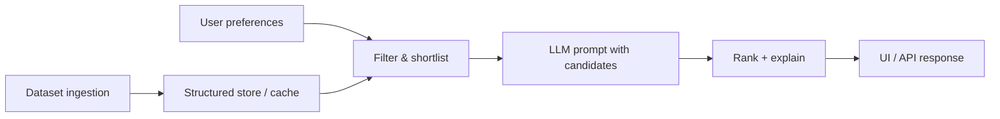

# Problem Statement: AI-Powered Restaurant Recommendation System

## Project context

This repository implements an **AI-powered restaurant recommendation service** inspired by [Zomato](https://www.zomato.com)—a platform where users discover dining options by city, cuisine, budget, and ratings. The project is a learning and engineering exercise: combine **real restaurant data** with a **Large Language Model (LLM)** so recommendations feel personalized and explainable, not just a sorted table of rows.

At a high level, the system:

1. Ingests and preprocesses a public Zomato-style dataset.
2. Accepts natural preference inputs from the user (location, budget, cuisine, rating, and free-text needs).
3. Filters candidates with structured logic, then uses an LLM to rank, reason, and explain choices.
4. Presents a small set of top picks with clear, human-readable rationale.

The name **ZOMATO** reflects the use case (restaurant discovery in Indian cities); this is not an official Zomato product or integration.

---

## Problem we are solving

### User pain

Choosing where to eat is overwhelming when:

- There are **thousands of options** in a single city.
- Filters on typical apps return **long, undifferentiated lists** with little guidance.
- Users often have **soft constraints** (“date night,” “quick lunch,” “kid-friendly”) that are hard to express in rigid dropdowns.
- **Trade-offs** (rating vs. cost vs. distance vs. cuisine) are tedious to compare manually.

### Limitations of naive approaches

| Approach | Limitation |
|----------|------------|
| Sort by rating only | Ignores budget, cuisine fit, and subjective context |
| Rule-only filters | Cannot interpret vague or compound preferences |
| LLM-only (no data) | Hallucinates restaurants; not grounded in real listings |

### Our approach

**Hybrid retrieval + generation:** narrow the dataset with deterministic filters, then let the LLM **rank and explain** a bounded set of real restaurants. That keeps answers **faithful to data** while still feeling **conversational and tailored**.

---

## Objectives

Design and implement an application that:

- Takes user preferences: **location**, **budget**, **cuisine**, **minimum rating**, and optional **free-text** preferences (e.g. family-friendly, quick service, outdoor seating).
- Uses a **real-world dataset** of restaurants (not synthetic placeholders).
- Uses an **LLM** to produce personalized, human-like recommendations with short explanations.
- Displays results in a **clear, scannable** format for end users.

### Success criteria (definition of done)

- Dataset loads reliably and exposes the fields needed for filtering and display.
- User can submit preferences and receive **top N** recommendations (N configurable, e.g. 3–5).
- Each recommendation includes: **name**, **cuisine**, **rating**, **estimated cost**, and an **AI-generated explanation** tied to the user’s inputs.
- Recommendations are **grounded** in filtered dataset rows (no invented venues).
- Failures (no matches, API errors) are handled with **actionable messages** (e.g. relax filters).

---

## Data source

| Item | Detail |
|------|--------|
| Dataset | [ManikaSaini/zomato-restaurant-recommendation](https://huggingface.co/datasets/ManikaSaini/zomato-restaurant-recommendation) on Hugging Face |
| Scale | ~51.7k rows (~574 MB) |
| Role | Source of truth for restaurant names, locations, cuisines, costs, ratings, and related attributes |

**Ingestion goals:** load the dataset, normalize/clean relevant columns, and retain fields such as restaurant name, city/location, cuisine type(s), approximate cost for two, aggregate rating, and any columns useful for filtering or display.

---

## System workflow

### 1. Data ingestion

- Load and preprocess the Hugging Face dataset.
- Extract and standardize: restaurant name, location, cuisine, cost, rating, and other useful attributes.
- Optionally cache processed data locally for faster repeat runs.

### 2. User input

Collect:

| Input | Examples |
|-------|----------|
| Location | Delhi, Bangalore, Mumbai |
| Budget | Low, medium, high (mapped to cost bands in data) |
| Cuisine | Italian, Chinese, North Indian |
| Minimum rating | e.g. 4.0+ |
| Additional preferences | Family-friendly, quick service, quiet ambiance (free text) |

### 3. Integration layer

- Apply **structured filters** from user input to reduce the candidate set.
- Build an **LLM prompt** that includes: user preferences, a capped list of candidates (with key fields), and instructions to rank and explain without inventing restaurants.
- Prompt design should encourage: consistent ranking criteria, brief per-restaurant rationale, and optional overall summary.

### 4. Recommendation engine

The LLM should:

- **Rank** shortlisted restaurants for the given context.
- **Explain** why each pick fits the stated preferences.
- Optionally **summarize** trade-offs or suggest relaxing constraints if matches are weak.

### 5. Output display

Present top recommendations in a user-friendly format, for example:

- Restaurant name  
- Cuisine  
- Rating  
- Estimated cost (for two, or as defined in dataset)  
- AI-generated explanation (why this match fits the user)

Delivery may be a **web UI**, **CLI**, or **API**—implementation choice is left to the codebase as it evolves.

---

## Scope and non-goals

**In scope**

- End-to-end flow: data → preferences → filtered candidates → LLM → displayed results.
- Grounded recommendations from the Zomato-style dataset.
- Configurable filters and prompt templates.

**Out of scope (unless explicitly added later)**

- Live Zomato API integration, ordering, or payments.
- Real-time availability, table booking, or delivery tracking.
- User accounts, saved history, or collaborative filtering across users.
- Production-scale deployment, auth, or billing (unless a later milestone requires them).

---

## Technical considerations (guidance for implementation)

- **Tech stack:** Java 21 and Spring Boot 3.x (REST API, layered services, configuration via `application.yml` and environment variables). See [architecture.md](./architecture.md) for component and module design.
- **Grounding:** Always pass restaurant IDs or canonical names from the filtered set; instruct the model not to add venues outside that list.
- **Token limits:** Cap how many candidates go into each LLM call; pre-sort by rating/cost fit if the shortlist is still large.
- **Cost & latency:** Prefer smaller/faster models for iteration; allow swapping model provider via configuration.
- **Secrets:** API keys via environment variables or Spring externalized config, never committed to the repo.

---

## References

- Dataset: https://huggingface.co/datasets/ManikaSaini/zomato-restaurant-recommendation  
- Inspiration: Zomato-style restaurant discovery (city + cuisine + budget + ratings)
